# AI生成Mesh到参数化CAD转换工具

## 技术方案文档

---

**版本**: 1.0
**日期**: 2025年1月
**文档性质**: 技术规划文档

---

## 第一章 项目概述

### 1.1 项目背景

当前设计行业面临的核心痛点:

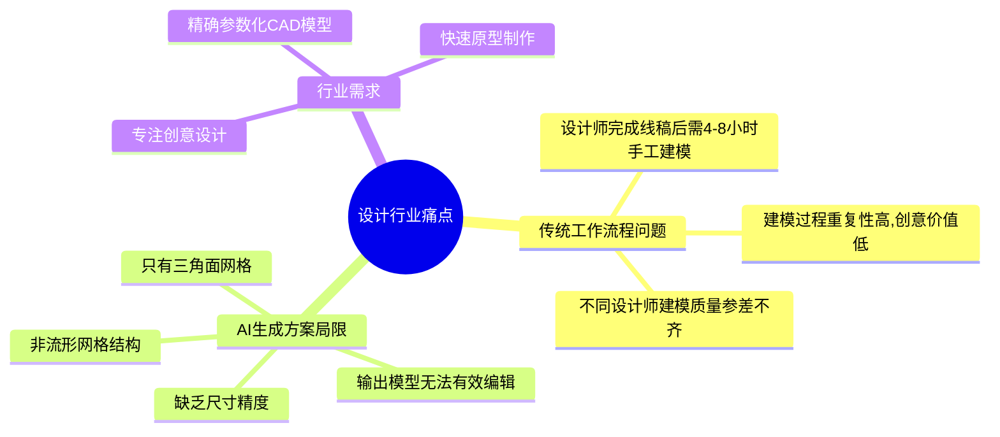

### 1.2 项目目标

构建一套完整的工具链,实现从AI生成的粗糙网格到精密参数化CAD模型的自动转换。

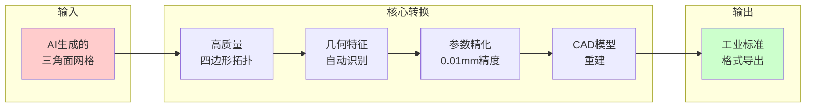

**量化指标**

| 指标 | 目标值 | 说明 |
|------|--------|------|
| ⏱️ 时间效率 | 25-45分钟 | 从4-8小时手工建模大幅缩短 |
| 🎯 精度要求 | 0.01mm | 规则特征精度 |
| 🤖 自动化程度 | 70% | 30%人工参数确认 |
| ✅ 特征识别率 | >80% | 识别准确率 |

### 1.3 产品定位

本工具定位为**设计师的AI建模助手**:

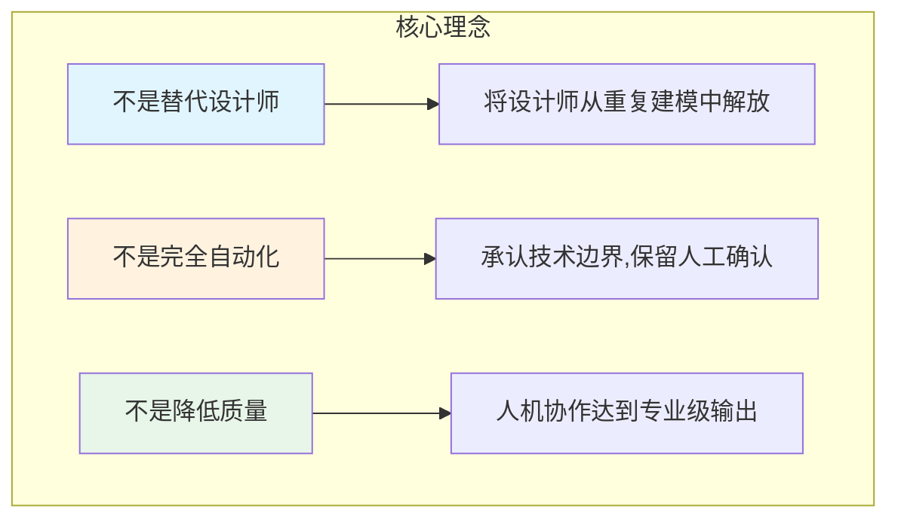

**目标用户画像**

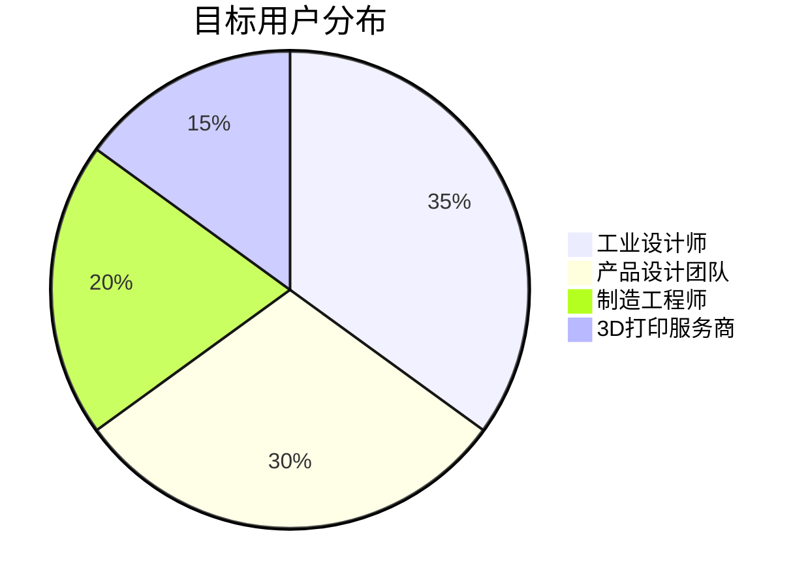

---

## 第二章 需求分析

### 2.1 功能需求

#### 2.1.1 输入输出需求

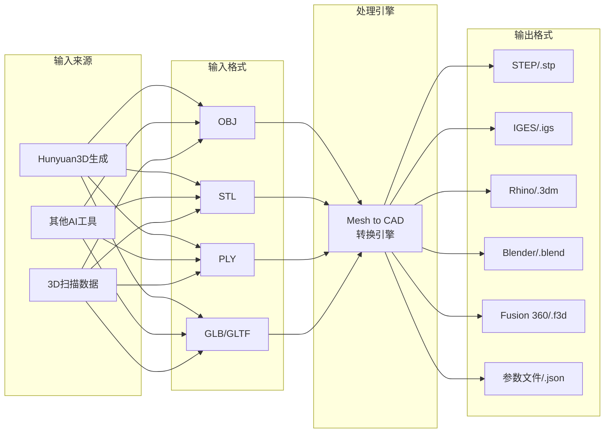

#### 2.1.2 处理需求总览

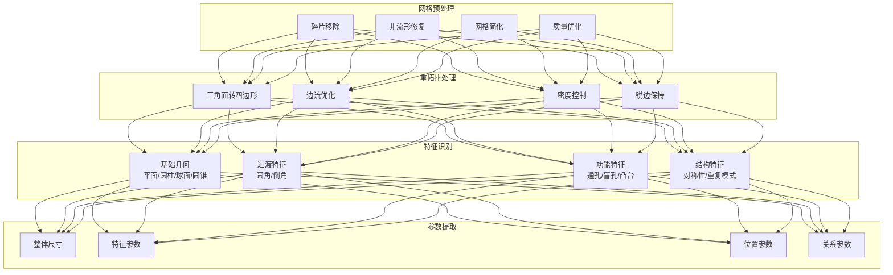

**精度要求**

| 特征类型 | 目标精度 | 说明 |
|---------|---------|------|
| 整体尺寸 | 0.01mm | 人工输入精确值 |
| 圆角半径 | 0.01mm | CAD内核精确生成 |
| 孔特征 | 0.01mm | 支持公差标注(如H7) |
| 平面特征 | 0.01mm | 精确平面定义 |
| 有机曲面 | 0.05-0.1mm | NURBS拟合近似 |

### 2.2 参数化需求

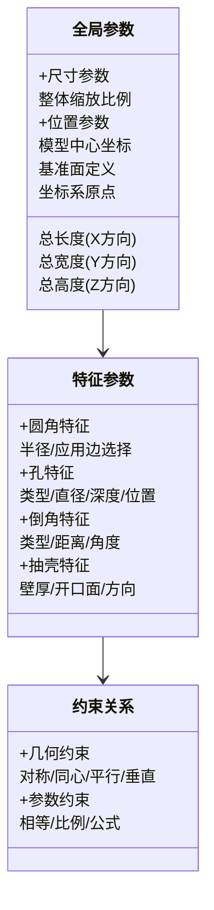

### 2.3 交互需求

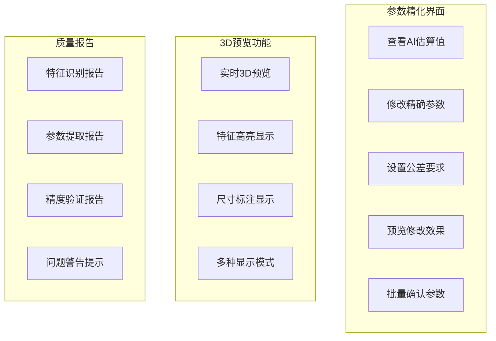

### 2.4 集成需求

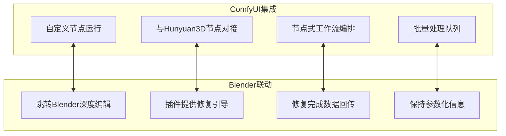

---

## 第三章 系统架构

### 3.1 整体架构设计

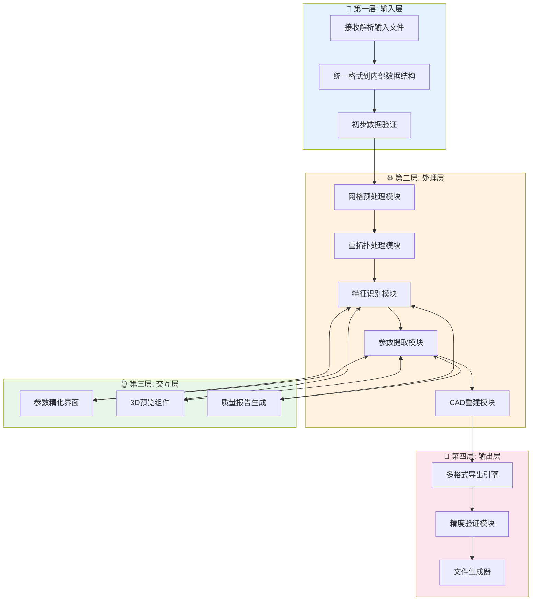

### 3.2 数据流设计

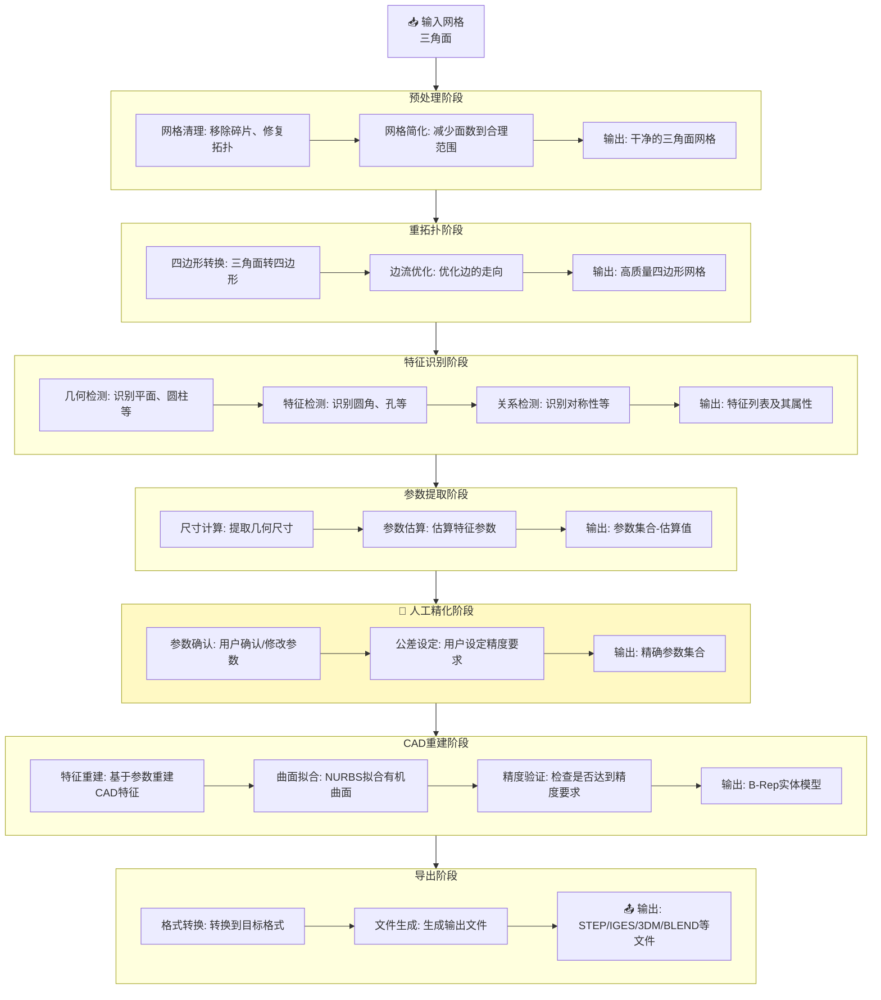

### 3.3 模块设计

#### 3.3.1 预处理模块

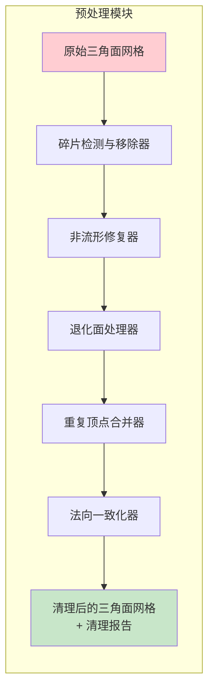

#### 3.3.2 重拓扑模块

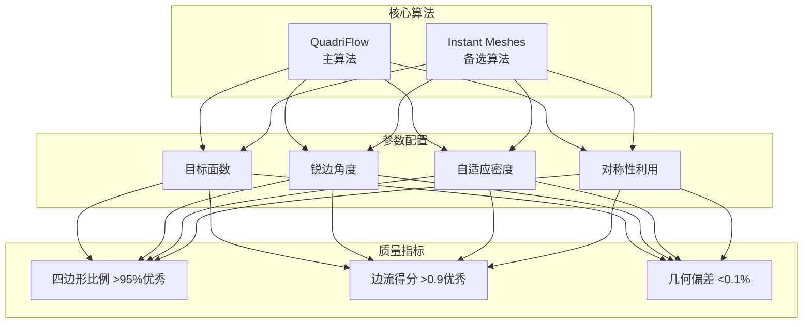

#### 3.3.3 特征识别模块

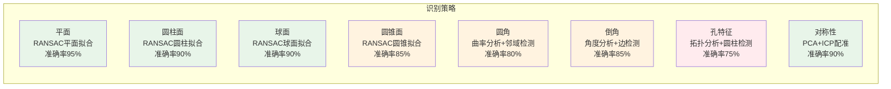

**特征数据结构**

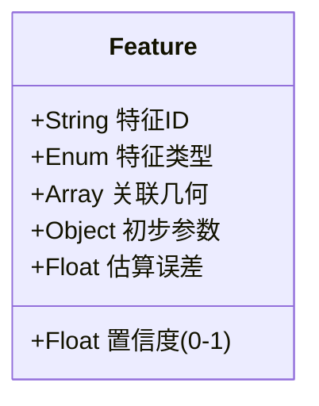

#### 3.3.4 CAD重建模块

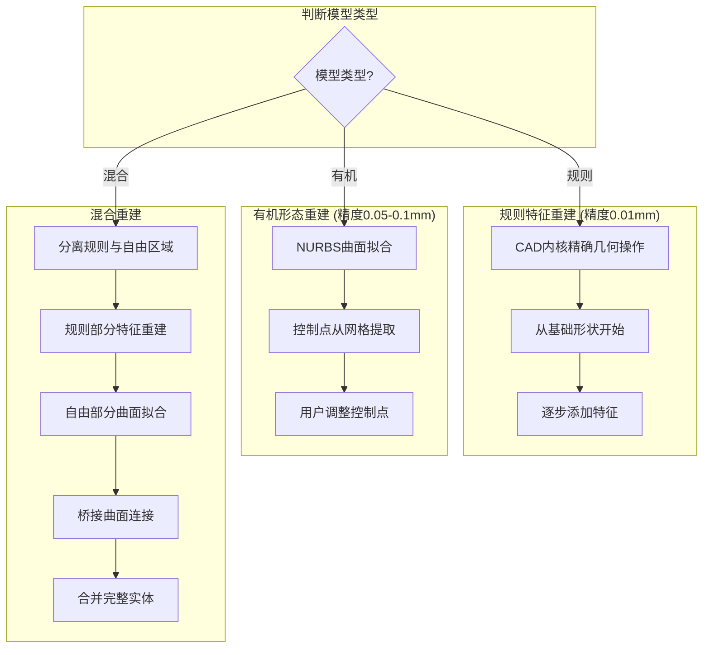

### 3.4 ComfyUI节点设计

#### 3.4.1 节点分类

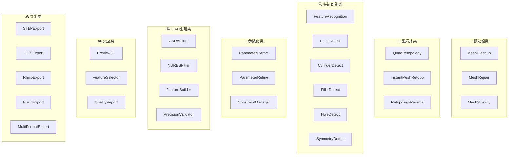

#### 3.4.2 标准工作流

**基础工作流** (适用于简单模型)

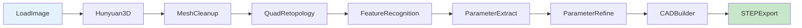

**精密工作流** (适用于高精度要求)

```mermaid
flowchart LR
    A[LoadImage] --> B[Hunyuan3D] --> C[MeshCleanup] --> D[MeshRepair] --> E[QuadRetopology]
    E --> F[FeatureRecognition] --> G[ParameterExtract] --> H[ParameterRefine]
    H --> I[CADBuilder] --> J[PrecisionValidator] --> K[MultiFormatExport]

    style A fill:#e3f2fd
    style K fill:#c8e6c9
```

**有机形态工作流** (适用于复杂曲面)

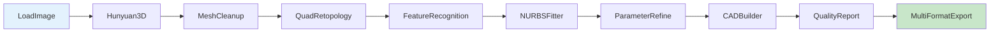

#### 3.4.3 数据类型定义

```mermaid
classDiagram
    class MESH {
        顶点数据
        面数据
        法向数据
    }

    class QUAD_MESH {
        四边形顶点
        四边形面
        边流信息
    }

    class FEATURE_LIST {
        特征数组
        置信度信息
        关联几何
    }

    class PARAMETER_SET {
        估算参数值
        误差范围
        参数类型
    }

    class REFINED_PARAMS {
        精确参数值
        公差设定
        用户确认状态
    }

    class CAD_SOLID {
        B-Rep实体
        特征树
        参数历史
    }

    class QUALITY_REPORT {
        质量得分
        各阶段报告
        问题列表
    }

    MESH --> QUAD_MESH : 重拓扑
    QUAD_MESH --> FEATURE_LIST : 特征识别
    FEATURE_LIST --> PARAMETER_SET : 参数提取
    PARAMETER_SET --> REFINED_PARAMS : 人工精化
    REFINED_PARAMS --> CAD_SOLID : CAD重建
    CAD_SOLID --> QUALITY_REPORT : 验证报告
```

---

## 第四章 技术选型

### 4.1 核心技术栈

```mermaid
graph TB
    subgraph 开发语言
        L[Python 3.10+<br>主要语言]
    end

    subgraph 工作流框架
        F[ComfyUI<br>节点式工作流]
    end

    subgraph 网格处理
        M1[PyMeshLab<br>网格清理修复]
        M2[Trimesh<br>数据读写操作]
        M3[Open3D<br>点云几何分析]
    end

    subgraph CAD处理
        C1[CadQuery<br>CAD建模主选]
        C2[OpenCascade<br>底层内核]
        C3[geomdl<br>NURBS处理]
    end

    subgraph 可视化
        V1[PyVista<br>3D可视化]
        V2[VTK<br>渲染引擎]
    end

    L --> F
    L --> M1 & M2 & M3
    L --> C1 & C2 & C3
    L --> V1 & V2
```

### 4.2 重拓扑技术对比

```mermaid
graph LR
    subgraph QuadriFlow-主选["QuadriFlow (主选)"]
        Q1[✅ 边流质量高]
        Q2[✅ 拓扑结构规整]
        Q3[✅ 学术认可度高]
        Q4[❌ 速度相对较慢]
        Q5[❌ 需编译C++代码]
    end

    subgraph InstantMeshes-备选["Instant Meshes (备选)"]
        I1[✅ 速度快]
        I2[✅ 支持交互调整]
        I3[❌ 边流质量稍逊]
    end

    style QuadriFlow-主选 fill:#e8f5e9
    style InstantMeshes-备选 fill:#fff3e0
```

### 4.3 CAD内核选择

```mermaid
graph TB
    subgraph CadQuery-推荐["CadQuery (推荐)"]
        C1[✅ Python原生API]
        C2[✅ 语法简洁直观]
        C3[✅ 活跃社区支持]
        C4[✅ 完整STEP/IGES支持]
        C5[⚠️ 文档相对较少]
    end

    subgraph OpenCascade-备选["OpenCascade (备选)"]
        O1[✅ 功能最完整]
        O2[✅ 工业级稳定性]
        O3[❌ C++ API集成复杂]
        O4[❌ 学习曲线陡峭]
    end

    style CadQuery-推荐 fill:#e8f5e9
    style OpenCascade-备选 fill:#fff3e0
```

### 4.4 依赖库汇总

```mermaid
graph TB
    subgraph 核心依赖["🔷 核心依赖"]
        D1["Python ≥3.10"]
        D2["ComfyUI ≥1.0"]
        D3["numpy ≥1.24"]
        D4["scipy ≥1.11"]
    end

    subgraph 网格处理["🔶 网格处理"]
        D5["trimesh ≥4.0"]
        D6["pymeshlab ≥2023.12"]
        D7["open3d ≥0.18"]
    end

    subgraph CAD处理["🔷 CAD处理"]
        D8["cadquery ≥2.4"]
        D9["OCP ≥7.7"]
        D10["geomdl ≥5.3"]
    end

    subgraph 可视化["🔶 可视化"]
        D11["pyvista ≥0.43"]
        D12["vtk ≥9.3"]
    end

    subgraph 工具库["🔷 工具库"]
        D13["scikit-learn ≥1.3"]
        D14["tqdm ≥4.66"]
        D15["pyyaml ≥6.0"]
    end
```

---

## 第五章 关键算法设计

### 5.1 重拓扑算法

```mermaid
flowchart TB
    A[输入: 三角面网格 M_tri] --> B

    subgraph B[第一步: 预分析]
        B1[计算模型包围盒和尺度]
        B2[检测锐边]
        B3[估算合适的目标面数]
    end

    B --> C

    subgraph C[第二步: 参数配置]
        C1[设置目标四边形数量]
        C2[配置锐边保持角度]
        C3[选择是否启用自适应密度]
    end

    C --> D

    subgraph D[第三步: 执行重拓扑]
        D1[调用QuadriFlow算法]
        D2[生成四边形主导的网格]
        D3[锐边区域保持原有边界]
    end

    D --> E

    subgraph E[第四步: 后处理]
        E1[检查四边形比例]
        E2[评估边流质量]
        E3[计算几何偏差]
    end

    E --> F

    subgraph F[第五步: 质量验证]
        F1{质量达标?}
        F2[调整参数重试<br>最多3次]
        F3[选择最佳结果]
    end

    F1 -->|否| F2 --> D
    F1 -->|是| F3 --> G[输出: 四边形网格 M_quad]

    style A fill:#ffcdd2
    style G fill:#c8e6c9
```

**质量评估指标**

| 指标 | 优秀 | 良好 | 可接受 |
|------|------|------|--------|
| 四边形比例 | > 95% | > 90% | > 80% |
| 边流得分 | > 0.9 | > 0.8 | > 0.7 |
| 几何偏差 | < 0.05% | < 0.1% | < 0.15% |

### 5.2 特征识别算法

#### 5.2.1 平面识别流程

```mermaid
flowchart TB
    A[输入: 网格顶点集合] --> B

    subgraph B[1. 初始化]
        B1[设置RANSAC参数]
        B2[迭代次数: 1000]
        B3[距离阈值: 模型尺寸*0.001]
        B4[最小点数: 100]
    end

    B --> C

    subgraph C[2. RANSAC迭代]
        C1[随机选择3个点确定平面]
        C2[计算所有点到平面距离]
        C3[统计内点数量]
        C4[更新最佳平面]
    end

    C --> D

    subgraph D[3. 平面精化]
        D1[对内点最小二乘拟合]
        D2[获得精确平面参数]
        D3[计算拟合误差]
    end

    D --> E

    subgraph E[4. 平面分割]
        E1[移除已识别平面的点]
        E2{还有足够点?}
    end

    E2 -->|是| C
    E2 -->|否| F

    subgraph F[5. 结果整理]
        F1[合并相邻共面区域]
        F2[计算每个平面置信度]
    end

    F --> G[输出: 平面特征列表]

    style A fill:#e3f2fd
    style G fill:#c8e6c9
```

#### 5.2.2 圆角识别流程

```mermaid
flowchart TB
    A[输入: 四边形网格] --> B

    subgraph B[1. 曲率计算]
        B1[计算高斯曲率]
        B2[计算平均曲率]
        B3[标记曲率异常区域]
    end

    B --> C

    subgraph C[2. 候选区域提取]
        C1[找到曲率在特定范围内的顶点]
        C2[非平面、非锐边区域]
    end

    C --> D

    subgraph D[3. 邻域聚类]
        D1[相邻候选顶点聚类]
        D2[每个连通区域为候选圆角]
    end

    D --> E

    subgraph E[4. 圆弧拟合]
        E1[提取截面点]
        E2[拟合圆弧获得半径]
        E3[计算拟合残差]
    end

    E --> F

    subgraph F[5. 置信度评估]
        F1[基于残差计算置信度]
        F2[过滤低置信度结果]
    end

    F --> G[输出: 圆角特征列表]

    style A fill:#e3f2fd
    style G fill:#c8e6c9
```

#### 5.2.3 对称性识别流程

```mermaid
flowchart TB
    A[输入: 网格] --> B

    subgraph B[1. PCA分析]
        B1[计算顶点协方差矩阵]
        B2[求解主成分方向]
        B3[获得3个主轴方向]
    end

    B --> C

    subgraph C[2. 候选平面生成]
        C1[对每个主轴生成过质心的垂直平面]
    end

    C --> D

    subgraph D[3. 对称性验证]
        D1[将模型镜像]
        D2[使用ICP算法配准]
        D3[计算配准后残差]
    end

    D --> E

    subgraph E[4. 对称得分计算]
        E1["对称得分 = 1 - (残差/模型尺寸)"]
        E2{得分 > 0.9?}
    end

    E2 -->|是| F[存在对称性]
    E2 -->|否| G[无对称性]

    F --> H[输出: 对称平面]

    style A fill:#e3f2fd
    style H fill:#c8e6c9
```

### 5.3 CAD重建算法

```mermaid
flowchart TB
    subgraph 规则特征重建
        R1[创建基础形状<br>盒体/圆柱/球体]
        R2[应用特征操作<br>抽壳→孔→圆角→倒角]
        R3[使用精化后的精确参数]
        R4[记录失败特征尝试调整]
    end

    subgraph 有机形态重建
        O1[截面扫掠法<br>适用于旋转体/拉伸体]
        O2[曲面拟合法<br>适用于复杂自由曲面]
        O3[混合重建法<br>规则+自由曲面组合]
    end

    subgraph 精度控制
        P1[所有操作使用精确参数]
        P2[参数值保留到0.001mm]
        P3[重建后测量关键尺寸]
        P4[与目标参数比较验证]
    end

    R1 --> R2 --> R3 --> R4
    O1 & O2 & O3 --> P1 --> P2 --> P3 --> P4
```

---

## 第六章 用户交互设计

### 6.1 参数精化界面布局

```mermaid
graph TB
    subgraph 界面布局
        subgraph 左侧-3D预览区
            L1[实时3D模型显示]
            L2[旋转/缩放/平移]
            L3[显示模式切换<br>实体/线框/特征高亮]
            L4[选中特征高亮]
        end

        subgraph 右侧-参数列表区
            R1[分类显示所有参数]
            R2[AI估算值显示]
            R3[精确值输入框]
            R4[公差设置]
            R5[确认状态指示]
        end

        subgraph 底部-操作区
            B1[进度显示]
            B2[操作按钮<br>预览/应用/重置/导出]
            B3[警告和提示信息]
        end
    end
```

### 6.2 参数显示格式

```mermaid
classDiagram
    class 参数显示项 {
        +String 参数名称: 圆角半径#1
        +String AI估算值: R4.8mm
        +Input 精确值输入框
        +Input 公差输入框: ±0.01
        +Select 单位选择
        +Status 确认状态: 已确认/待确认
        +Button 高亮按钮
    }
```

### 6.3 交互流程

```mermaid
sequenceDiagram
    participant U as 用户
    participant S as 系统
    participant V as 3D视图

    S->>U: 显示所有检测参数及估算值
    U->>V: 点击参数高亮按钮
    V->>V: 高亮对应几何区域
    U->>S: 修改参数到精确值
    S->>V: 实时预览参数修改效果
    U->>S: 设置公差要求
    S->>S: 验证参数一致性
    S->>U: 显示验证结果
    U->>S: 批量确认参数
    S->>S: 生成精确参数集
```

### 6.4 Blender联动流程

```mermaid
flowchart LR
    A[质量评分<70分<br>或存在无法处理的问题] --> B{用户选择}
    B -->|继续| C[自动处理]
    B -->|深度编辑| D[跳转Blender]

    D --> E[Blender插件加载]
    E --> F[显示待修复问题列表]
    F --> G[自动高亮问题区域]
    G --> H[用户手动修复]
    H --> I[一键回传数据]
    I --> J[更新质量报告]
    J --> C
```

---

## 第七章 开发计划

### 7.1 项目阶段划分

```mermaid
gantt
    title AI Mesh to CAD 开发计划
    dateFormat  YYYY-MM-DD

    section 第一阶段: 基础架构
    环境搭建           :a1, 2025-01-06, 2w
    预处理模块         :a2, after a1, 2w
    重拓扑模块         :a3, after a2, 2w
    基础工作流整合     :a4, after a3, 2w
    里程碑M1           :milestone, m1, after a4, 0d

    section 第二阶段: 特征与参数
    基础特征识别       :b1, after a4, 2w
    高级特征识别       :b2, after b1, 2w
    参数化模块         :b3, after b2, 2w
    里程碑M2           :milestone, m2, after b3, 0d

    section 第三阶段: CAD重建
    CAD内核集成        :c1, after b3, 2w
    有机形态处理       :c2, after c1, 2w
    多格式导出         :c3, after c2, 2w
    里程碑M3           :milestone, m3, after c3, 0d

    section 第四阶段: 优化与测试
    性能优化           :d1, after c3, 2w
    测试与发布         :d2, after d1, 2w
    里程碑M4           :milestone, m4, after d2, 0d
```

### 7.2 里程碑汇总

```mermaid
timeline
    title 项目里程碑

    第8周 : M1 基础重拓扑Pipeline
          : 能够将三角面网格转换为四边形网格

    第14周 : M2 特征识别+参数精化
           : 能够识别基础特征并提供参数编辑界面

    第20周 : M3 精密CAD导出
           : 能够输出0.01mm精度的STEP文件

    第24周 : M4 正式发布v1.0
           : 完整功能、文档、测试通过
```

### 7.3 各阶段详细任务

```mermaid
mindmap
    root((开发任务))
        第一阶段
            第1-2周: 环境搭建
                Python开发环境
                ComfyUI开发环境
                依赖库安装验证
                编译QuadriFlow
            第3-4周: 预处理模块
                网格加载格式转换
                碎片检测移除
                非流形修复
            第5-6周: 重拓扑模块
                QuadriFlow封装
                Instant Meshes封装
                质量评估指标
            第7-8周: 基础工作流
                节点连接测试
                3D预览实现
        第二阶段
            第9-10周: 基础特征识别
                RANSAC平面检测
                圆柱面检测
                对称性检测
            第11-12周: 高级特征识别
                圆角检测
                孔特征检测
            第13-14周: 参数化模块
                参数提取算法
                参数精化界面
        第三阶段
            第15-16周: CAD内核集成
                CadQuery集成
                基础形状创建
                特征操作
            第17-18周: 有机形态处理
                NURBS曲面拟合
                混合重建策略
            第19-20周: 多格式导出
                STEP/IGES导出
                Rhino/Blender导出
        第四阶段
            第21-22周: 性能优化
                瓶颈分析
                并行处理
            第23-24周: 测试发布
                集成测试
                用户测试
                文档完善
```

### 7.4 资源需求

```mermaid
pie title 开发人员配置
    "Python后端开发" : 2
    "算法开发" : 1
    "前端/界面开发" : 1
    "测试人员" : 1
```

---

## 第八章 风险评估与缓解

### 8.1 风险矩阵

```mermaid
quadrantChart
    title 风险矩阵 (影响 vs 概率)
    x-axis 低概率 --> 高概率
    y-axis 低影响 --> 高影响
    quadrant-1 重点关注
    quadrant-2 持续监控
    quadrant-3 低优先级
    quadrant-4 需要缓解

    特征识别准确率不足: [0.5, 0.85]
    有机形态精度不达标: [0.7, 0.6]
    重拓扑质量不稳定: [0.5, 0.75]
    性能不达标: [0.5, 0.55]
    CAD内核功能限制: [0.3, 0.55]
    开发周期延长: [0.5, 0.5]
    需求变更: [0.5, 0.5]
```

### 8.2 风险详情与缓解措施

```mermaid
flowchart TB
    subgraph 风险1["⚠️ 风险1: 重拓扑质量不稳定"]
        R1D[描述: 复杂模型可能产生不理想结果]
        R1M[缓解措施]
        R1M1[提供多种重拓扑算法]
        R1M2[参数自动调优机制]
        R1M3[Blender手动处理路径]
        R1M --> R1M1 & R1M2 & R1M3
    end

    subgraph 风险2["⚠️ 风险2: 特征识别准确率不足"]
        R2D[描述: 复杂模型识别达不到预期]
        R2M[缓解措施]
        R2M1[人工标注补充]
        R2M2[用户修正识别结果]
        R2M3[反馈机制持续优化]
        R2M --> R2M1 & R2M2 & R2M3
    end

    subgraph 风险3["⚠️ 风险3: 有机形态精度不达标"]
        R3D[描述: NURBS拟合无法达到0.05mm精度]
        R3M[缓解措施]
        R3M1[分区策略高密度采样]
        R3M2[控制点手动调整]
        R3M3[明确告知用户限制]
        R3M --> R3M1 & R3M2 & R3M3
    end
```

### 8.3 风险应对优先级

| 风险 | 优先级 | 概率 | 影响 | 主要应对措施 |
|------|--------|------|------|-------------|
| 特征识别准确率不足 | 🔴 高 | 中 | 高 | 增加人工确认,持续优化 |
| 有机形态精度不达标 | 🔴 高 | 高 | 中 | 分区策略,明确告知限制 |
| 重拓扑质量不稳定 | 🟡 中 | 中 | 高 | 多算法备选,参数调优 |
| 性能不达标 | 🟡 中 | 中 | 中 | 持续优化,分块处理 |
| CAD内核功能限制 | 🟢 低 | 低 | 中 | 底层API调用 |
| 开发周期延长 | 🟡 中 | 中 | 中 | 敏捷开发,优先核心功能 |
| 需求变更 | 🟡 中 | 中 | 中 | 模块化架构,变更评估 |

---

## 第九章 验收标准

### 9.1 功能验收指标

```mermaid
graph TB
    subgraph 预处理功能
        A1["碎片移除: 移除<1%面积的孤立几何"]
        A2["非流形修复: 通过流形检查"]
        A3["网格简化: 偏差<1%"]
    end

    subgraph 重拓扑功能
        B1["四边形比例: >90%"]
        B2["几何偏差: <0.1%"]
        B3["处理时间: 10万面<60秒"]
    end

    subgraph 特征识别功能
        C1["平面识别: >90%"]
        C2["圆柱识别: >85%"]
        C3["圆角识别: >75%"]
        C4["孔特征识别: >70%"]
        C5["对称性识别: >85%"]
    end

    subgraph CAD重建功能
        D1["规则特征精度: <0.01mm"]
        D2["有机曲面精度: <0.1mm"]
        D3["特征应用成功率: >90%"]
    end
```

### 9.2 性能与质量验收

```mermaid
graph LR
    subgraph 性能指标
        P1["端到端处理时间<br>5万面模型<5分钟"]
        P2["内存占用<br>10万面模型<4GB"]
        P3["并发处理<br>支持队列处理"]
    end

    subgraph 质量指标
        Q1["代码覆盖率>70%"]
        Q2["API文档完整"]
        Q3["用户满意度>4/5"]
    end

    style P1 fill:#e8f5e9
    style P2 fill:#e8f5e9
    style P3 fill:#e8f5e9
    style Q1 fill:#e3f2fd
    style Q2 fill:#e3f2fd
    style Q3 fill:#e3f2fd
```

---

## 第十章 未来规划

### 10.1 版本演进路线

```mermaid
timeline
    title 产品演进路线图

    v1.0 : 基础功能发布
         : 网格预处理+重拓扑
         : 特征识别+参数精化
         : CAD重建+多格式导出

    v1.1 : 优化特征识别准确率
         : 增加更多特征类型
         : 改善用户界面体验

    v1.2 : 支持更多输入格式
         : 增加批量处理能力
         : 性能进一步优化

    v2.0 : 机器学习增强
         : 智能参数推荐
         : 装配体支持
         : 工程图生成
```

### 10.2 长期愿景

```mermaid
mindmap
    root((长期愿景))
        完整AI辅助设计工作流
            从草图到生产就绪CAD
            与主流CAD软件深度集成
            云端协作能力
        行业定制解决方案
            消费电子行业
            汽车零部件行业
            医疗器械行业
        技术深化
            机器学习特征识别
            实时协作编辑
            VR/AR预览支持
```

---

## 附录

### 附录A: 术语表

| 术语 | 英文 | 定义 |
|------|------|------|
| 网格 | Mesh | 由顶点和面组成的3D模型离散表示 |
| 重拓扑 | Retopology | 重新生成网格的拓扑结构 |
| 四边形网格 | Quad Mesh | 主要由四边形面组成的网格 |
| B-Rep | Boundary Representation | 边界表示,CAD模型的标准表示方法 |
| NURBS | Non-Uniform Rational B-Splines | 非均匀有理B样条曲面 |
| 特征 | Feature | CAD中的几何元素,如孔、圆角等 |
| 参数化 | Parametric | 通过参数定义几何,修改参数即可修改几何 |
| 公差 | Tolerance | 允许的尺寸偏差范围 |
| STEP | Standard for the Exchange of Product Data | 工业产品数据交换标准 |
| IGES | Initial Graphics Exchange Specification | 初始图形交换规范 |

### 附录B: 参考文献

1. Instant Field-Aligned Meshes (Instant Meshes算法论文)
2. QuadriFlow: A Scalable and Robust Method for Quadrangulation
3. OpenCascade Technology Documentation
4. CadQuery Documentation
5. ComfyUI Developer Guide

### 附录C: 测试模型建议

```mermaid
graph TB
    subgraph 简单测试模型
        S1[带圆角的盒体]
        S2[带孔的圆柱]
        S3[对称的产品外壳]
    end

    subgraph 中等测试模型
        M1[手机壳模型]
        M2[简单玩具模型]
        M3[基础家具零件]
    end

    subgraph 复杂测试模型
        C1[有机形态雕塑]
        C2[复杂曲面产品]
        C3[多特征组合模型]
    end

    style 简单测试模型 fill:#c8e6c9
    style 中等测试模型 fill:#fff9c4
    style 复杂测试模型 fill:#ffcdd2
```

---

**文档版本历史**

| 版本 | 日期 | 变更说明 | 作者 |
|------|------|---------|------|
| 1.0 | 2025年1月 | 初始版本 | - |
| 1.1 | 2025年1月 | 添加Mermaid图表,改为图文并茂格式 | - |

---

*文档结束*
